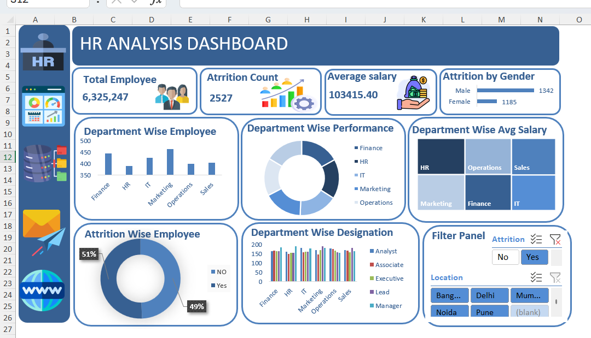

# Hr-Analysis-Dashboard-Excel
Interactive HR Analysis Dashboard built in Microsoft Excel using Pivot Tables, Charts, Slicers, and KPI Cards to analyze employee attrition, department performance, salary trends, and workforce distribution.

# HR Analysis Dashboard

## Project Overview

This project presents an Interactive HR Analysis Dashboard developed in Microsoft Excel to analyze workforce data and employee attrition trends.

The dashboard provides insights into employee distribution, department performance, average salary, attrition rates, and designation-wise workforce analysis through interactive visualizations and KPI cards.

---

## Objectives

- Monitor employee attrition trends
- Analyze department-wise employee distribution
- Compare average salary across departments
- Evaluate department performance ratings
- Understand gender-based attrition patterns
- Track designation-wise workforce allocation

---

## Key Performance Indicators (KPIs)

- Total Employees: 6,325,247
- Attrition Count: 2,527
- Average Salary: 103,415.40
- Attrition by Gender

---

## Dashboard Features

### Primary KPIs
- Total Employee Count
- Attrition Count
- Average Salary
- Attrition by Gender

### Department Analysis
- Department-wise Employee Distribution
- Department-wise Performance Rating
- Department-wise Average Salary

### Workforce Analysis
- Designation-wise Employee Distribution
- Attrition Analysis
- Interactive Filters

### Filters Available
- Attrition Status
- Location

---

## Tools Used

- Microsoft Excel
- Pivot Tables
- Pivot Charts
- Slicers
- KPI Cards
- Data Cleaning
- Data Visualization

---

## Skills Demonstrated

- Data Analysis
- Dashboard Design
- HR Analytics
- Business Intelligence
- Data Visualization
- Excel Reporting
- KPI Development

---

## Dashboard Preview

### HR Analysis Dashboard

### Pivot Tables

---

## Conclusion

This dashboard helps HR teams monitor workforce performance, identify attrition patterns, and support data-driven decision-making through interactive Excel-based reporting.
